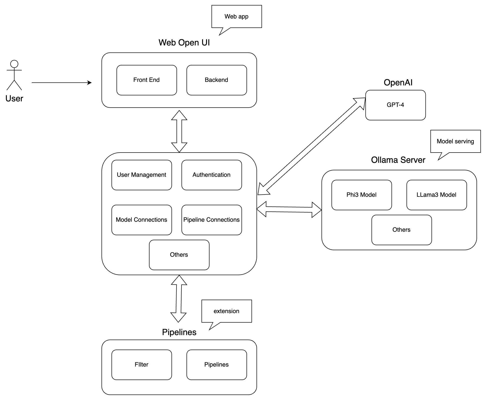

# Chatbot Service

This is a chatbot service that provides a web interface for users to interact with the chatbot. 
It also includes a backend that handles the logic and responses of the chatbot.

- [Chatbot Service](#chatbot-service)
  - [Features](#features)
  - [Technologies](#technologies)
  - [System Architecture](#system-architecture)
  - [Setup](#setup)
    - [Webopen-UI](#webopen-ui)
    - [Pipelines](#pipelines)
    - [Ollama](#ollama)
  - [Test](#test)


## Features

- User-friendly web interface for interacting with the chatbot
- Support for multiple languages and conversation contexts

## Technologies

**Front end**
- Webopen-ui: https://github.com/open-webui/open-webui

**Back end**
- Pipelines: https://github.com/open-webui/pipelines
- Ollama: https://github.com/ollama/ollama

## System Architecture
 


## Setup

In order to setup the project, we need 3 services 
- Webopen-ui
- Pipelines
- Ollama

You can run each service independently or run all services with script. 

```bash
# start webopen ai and pipelines and serving model
bash start.sh
# stop webopen ai and pipelines
bash stop.sh
```

Suppose you've installed the ollama and ollama server is started. Serve the model. Currently, I am using the phi3 lighweight model.   

Run model manually
```bash
curl http://localhost:11434/api/chat -d '{"model": "phi3", "keep_alive": -1}'
```

### Webopen-UI
```bash
docker run -d -p 3005:8080 --add-host=host.docker.internal:host-gateway -v vol-webui:/app/backend/data --name open-webui --restart always ghcr.io/open-webui/open-webui:main
```

### Pipelines
Mount pipelines folder to docker container. The default port of service is 9099. Furthermore, you need to configure the Pipelines in WebopenUI.
```bash
docker run -d -p 9099:9099 --add-host=host.docker.internal:host-gateway -v ./pipelines:/app/pipelines --name pipelines --restart always ghcr.io/open-webui/pipelines:main
```

### Ollama
Linux
```bash
curl -fsSL https://ollama.com/install.sh | sh
```

Normally, Ollama server is running on localhost. Therefore, you can not access the model directly from another machine.
Therefore, you need to configure Ollama server by following this section https://github.com/ollama/ollama/blob/main/docs/faq.md#setting-environment-variables-on-linux

Here is the steps:
1. Edit the systemd service by calling systemctl edit ollama.service. This will open an editor.

2. For each environment variable, add a line Environment under section [Service]:

```bash
[Service]
Environment="OLLAMA_HOST=0.0.0.0"
```

3. Save and exit.

4.Reload systemd and restart Ollama

```bash
systemctl daemon-reload
systemctl restart ollama
```

Note that, Ollama uses a context window size of 2048 tokens. The default port is 11434.

You need to keep the model alive, otherwise, after you run another model, Ollama will unload the old model.

```bash
# keep alive model
curl http://localhost:11434/api/chat -d '{"model": "phi3", "keep_alive": -1}'
# unload model
curl http://localhost:11434/api/chat -d '{"model": "llama2", "keep_alive": 0}'
```

Useful commands with Ollama
```bash
# start the server
ollama serve
# run model
ollama run phi3
```

## Test

Test post request with Ollama

```bash
curl http://localhost:11434/api/chat -d '{
  "model": "phi3",
  "prompt":"Why is the sky blue?"
}'
```

or 

```bash
curl http://localhost:11434/api/chat -d '{
  "model": "phi3",
  "messages": [
    { "role": "user", "content": "why is the sky blue?" }
  ]
}'
```

